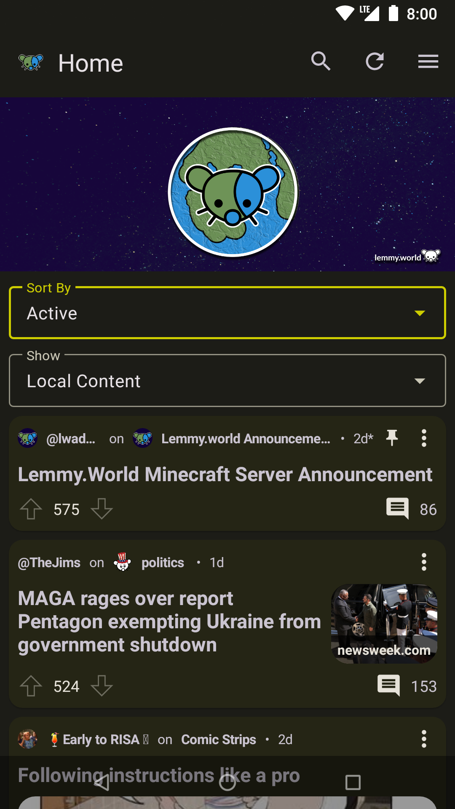
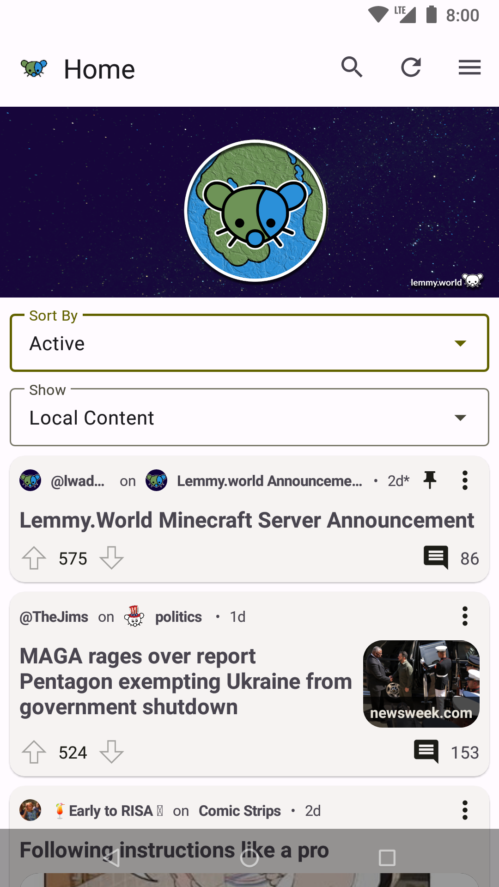

# 
Combustible is an app that allows you to interact with the [Lemmy](https://join-lemmy.org) link aggregation and discussion platform. Lemmy is completely free and open, and not controlled by any company.

**Disclaimer:** This is alpha-quality software. There will almost certainly be bugs.

## Screenshots

    
    

## Features
- Connect to any supported Lemmy instance!
- View communities, posts, and comments!
- Vote on posts and comments!
- Create posts, comments, and private messages!
- Search posts, comments, communities, and users!
- View replies, mentions, and private messages!

## Instances
To interact to Lemmy you must select an instance to connect to. The [Lemmy.world](https://lemmy.world) instance is recommended, but you can discover other instances on [Lemmy's official website](https://join-lemmy.org/instances).

## System Requirements
Combustible requires Android 5.0 (API 21) or newer.

## Installation
Download an APK from [GitHub Releases](https://github.com/TheBrokenRail/Combustible/releases) and install it!

## Other Resources
- [Todo List/Known Issues](TODO.md)
- [Frequently Asked Questions](FAQ.md)
- [Changelog](CHANGELOG.md)
- [API Library](api/README.md)